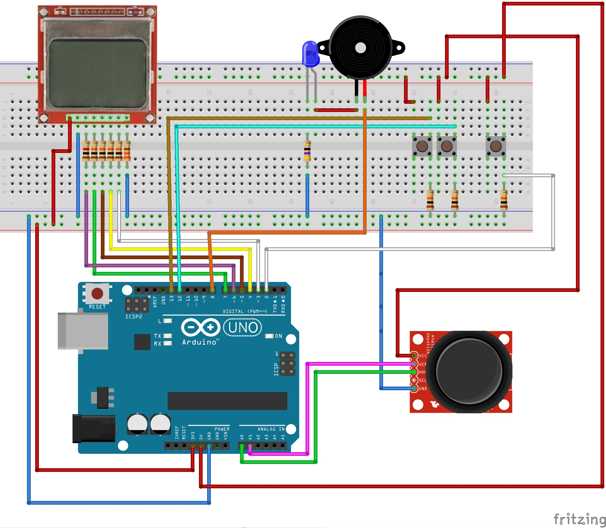

# minesweeper-arduino

This is an Arduino project to simulate minesweeper game. 

The Minesweeper is the mythical game that was ported to Microsoft Windows. The origin of this game goes back to the decade of the sixties and seventies and has been reproduced in numerous platforms, although it would not reach its fame until the adaptation made for Windows by Robert Donner.

